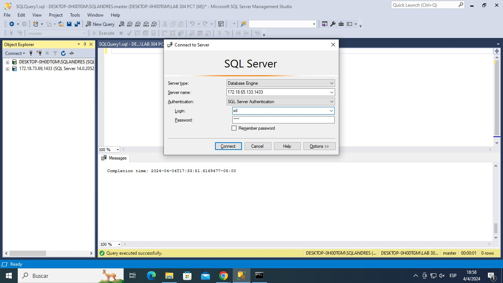
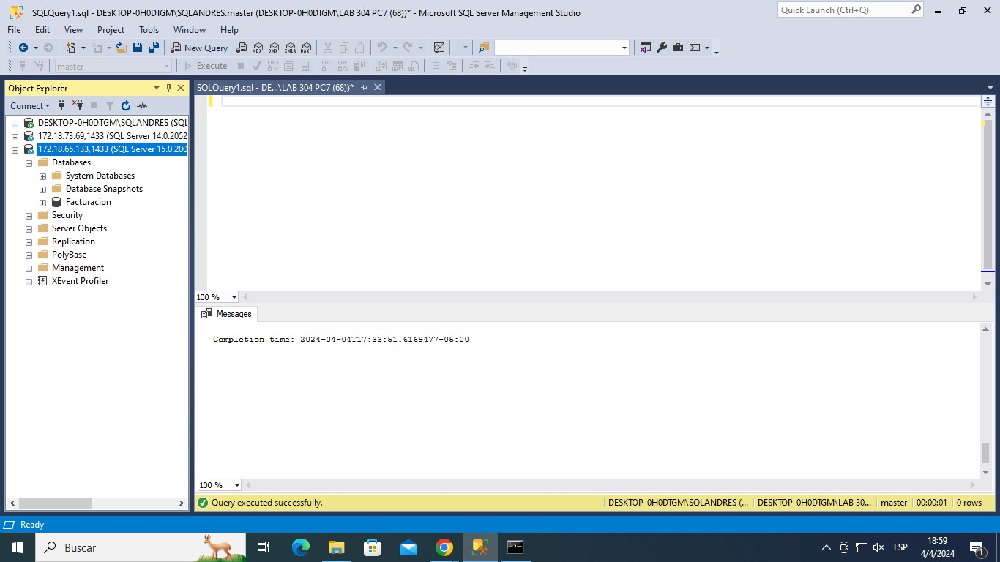

# Coneccion a la base de datos

1.	Conexión a la base de datos de otra máquina; se necesita especificar la conexión, para ello se utiliza la dirección ip de la máquina a la que nos queremos conectar seguido del puerto en este caso 1433, además se colocan las credenciales de usuario.

2.	 Visualización a los accesos a la base de datos autorizada desde el ordenador anterior.

