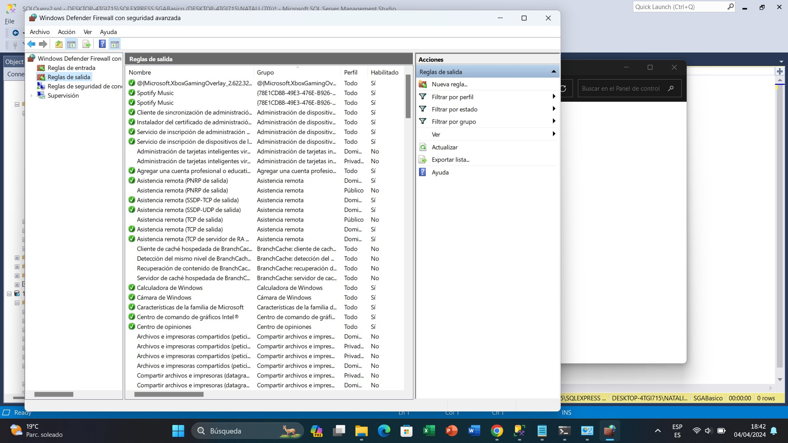
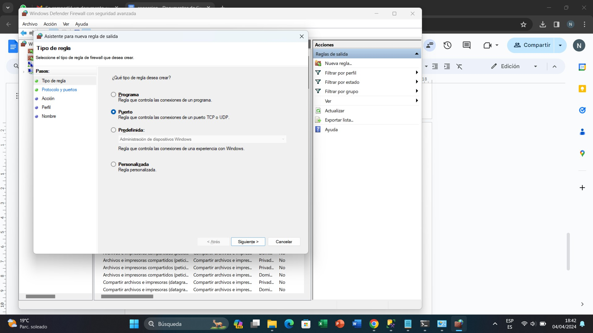
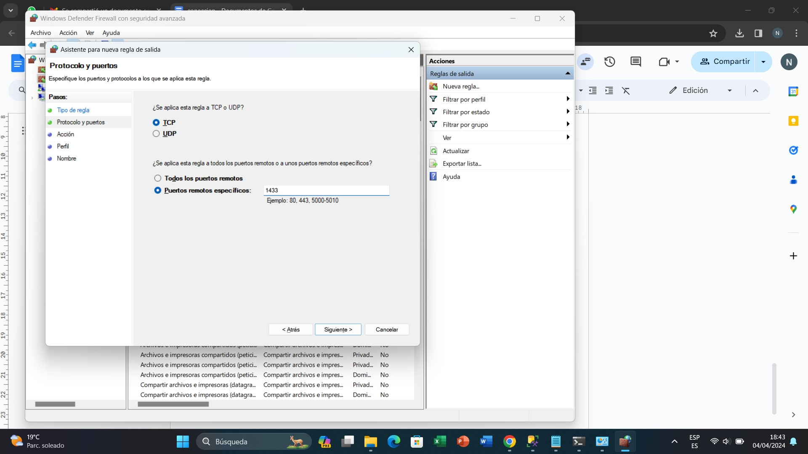
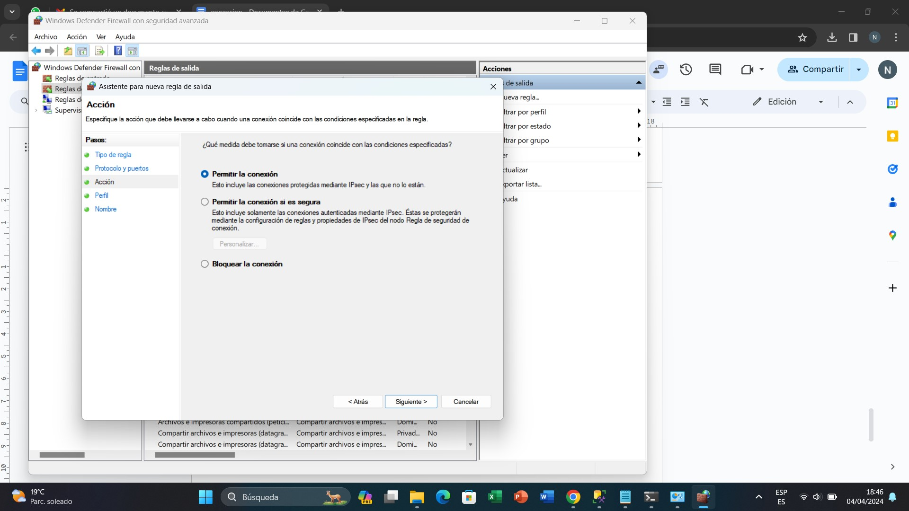
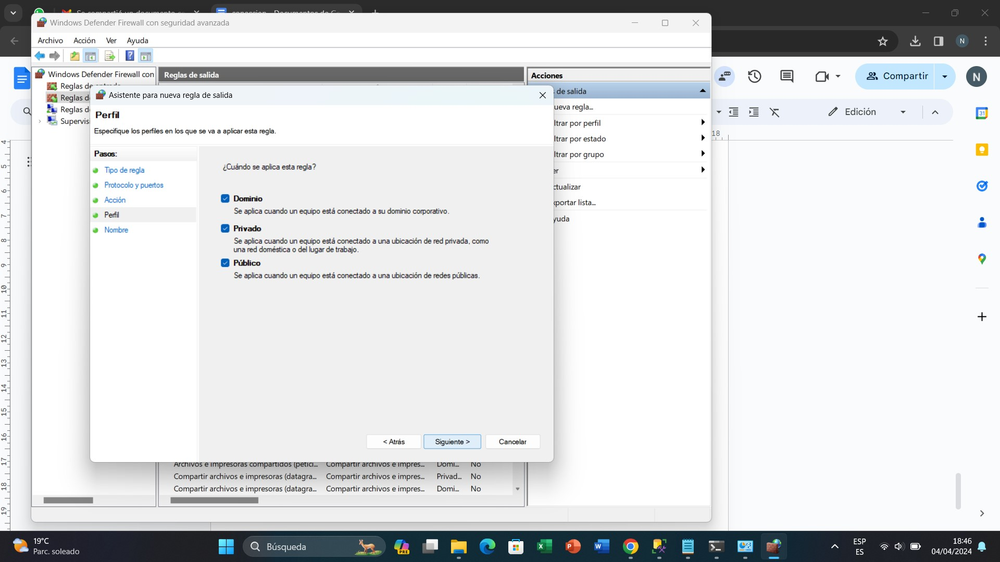
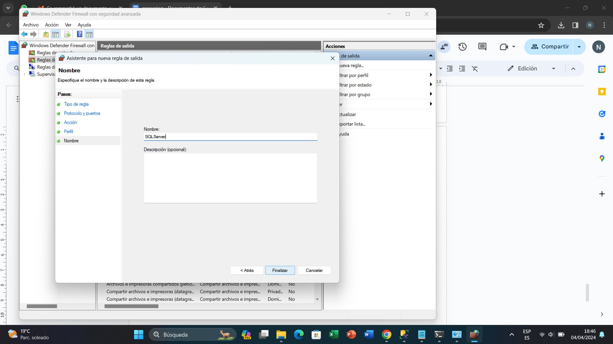

# Configuración de Firewall

1.	Configuración del Firewall, tanto de entrada como de salida; se crea una nueva regla. 

2.	Se selecciona el tipo de regla que se necesite; en este caso se selecciona la opción de puerto.

3.	Seleccionar puertos remotos específicos, ingresar el puerto este caso “1433”, puesto que es el puerto estándar de SQL Server.

4.	Se configura con la opción de permitir la conexión, debido a que es la opción de enlace que queremos utilizar.

5.	Se especifica cuando se desea aplicar esta regla, en este caso necesitamos utilizar todas las opciones.

6.	Asignar un nombre a la regla que se ha creado. 

