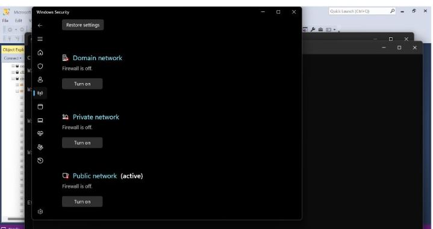
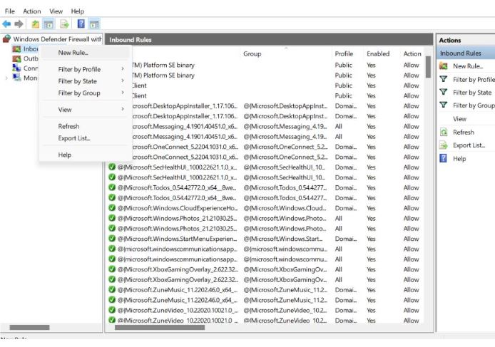
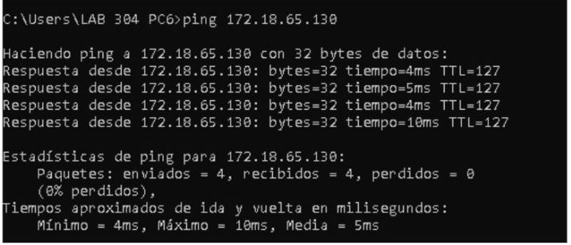
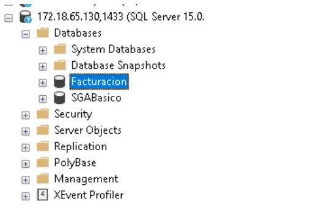

# Práctica 1
***Practica 1*** de Aministración de Sistemas de Gestión de Bases de Datos 

1. Primero se desactivo el Firewall de la computadora a la que se va a hacer la conexión:

2. Se agregó como al puerto 1433 como de entrada y salida:

3. Ping exitoso.

4. Se verifica que se pudo acceder a la base de datos

