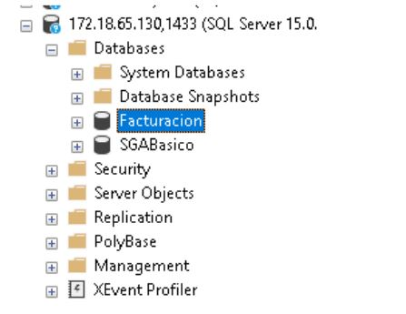

# Conexión y prueba de base de datos

1. Primero se desactivo el Firewall de la computadora a la que se va a hacer la conexión:

2.  Se agregó como al puerto 1433 como de entrada y salida:

3.  Luego se hace ping a la máquina para verificar que se puede realizar la conexión:

4.  Luego se hace conexión a la base de datos con el usuario creado:

5.  Se verifica que se pudo acceder a la base de datos

