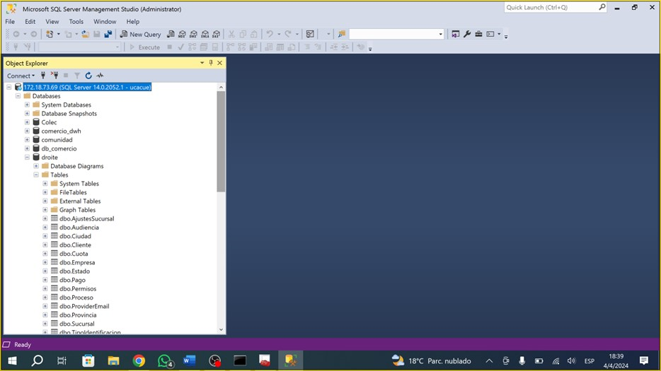
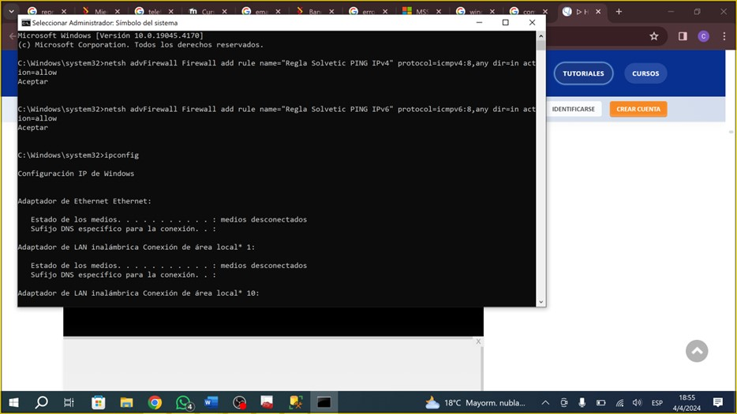
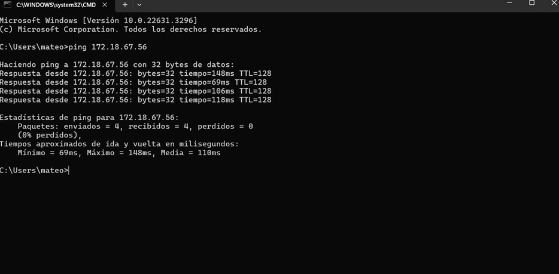
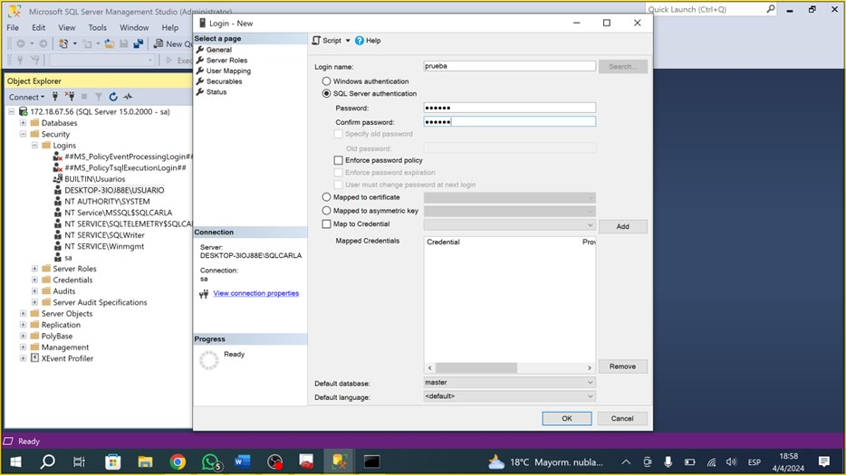
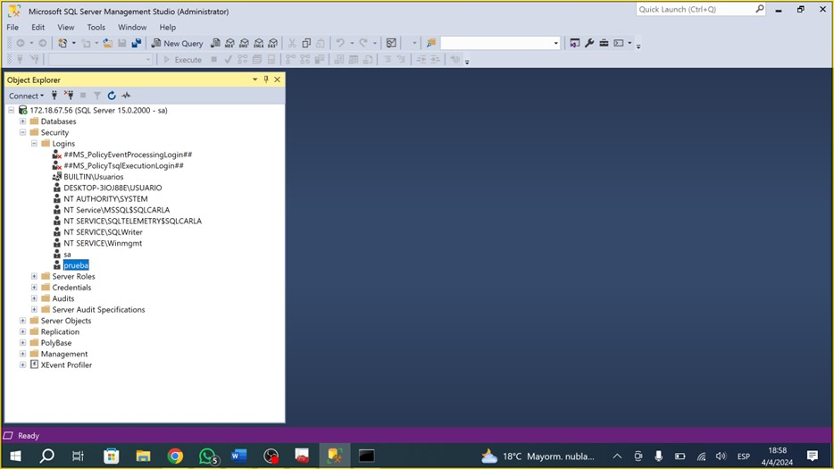
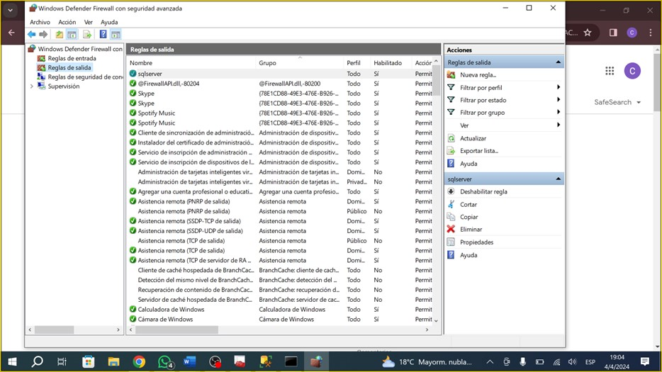
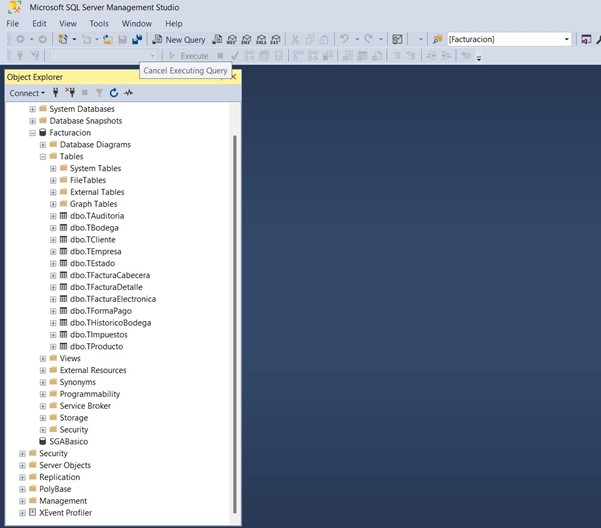

# Práctica 1
***Practica 1*** de Aministración de Sistemas de Gestión de Bases de Datos 

1. Conexión al usuario ucacue y BD droite.

2. Permitir conexión para un ping.

3. Ping exitoso.

4. Creación de un usuario "prueba" con permisos para la BD Facturación.

5. Usuario prueba creado.

6. Activar puerto 1433 del firewall.

7. Conexión al usuario prueba y a la BD Facturación exitosa.
