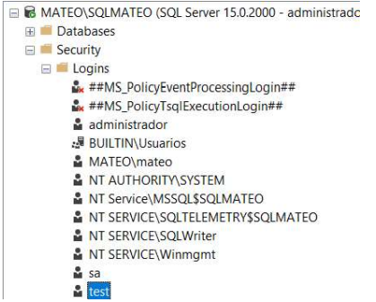

# Conexión a la base de datos.

1. Creacion de usuario Test para hacer la prueba:

2.  Ip de mi computadora a la cual se va a conectar mi compañero:
172.18.76.12

3.  Se desactiva el firewall:

4.  Hacemos ping a la maquina de mi compañero:

5.  Mi compañero me hace ping a mi:

6.  Me conecto a la base de datos de mi compañero con el usuario: usrPrueba

7.  Mi compañero se conecta a mi base de datos con el usuario: test

