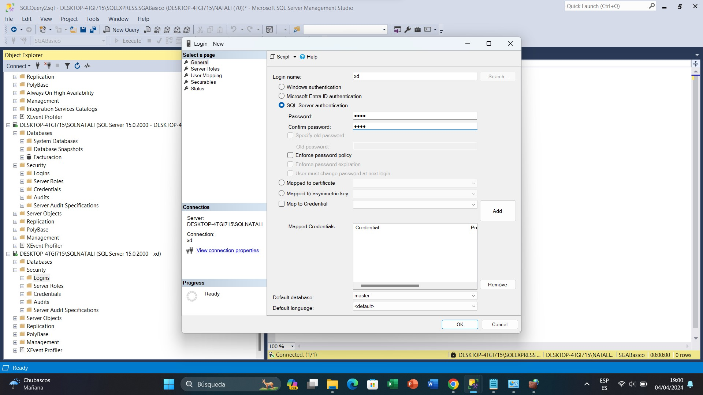
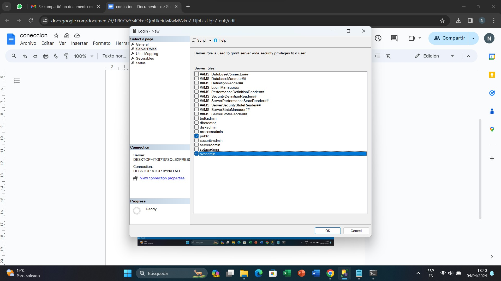
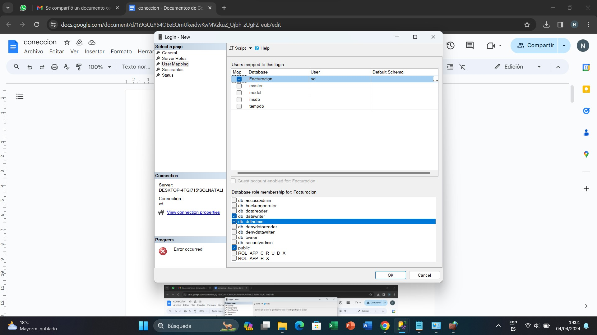

# Creación de usuarios

1. Creación de un Login; ingreso del nombre de “Login name” e ingreso del password de autenticación.

2. Asignamiento de roles de servidor para el Usuario; por defecto siempre será tipo público.

3.	Se asigna las Bases de Datos a las cuales se le quiera dar acceso y los roles que tendrá para esa base en específico; por defecto tiene un rol público.

