# PRACTICA #1 – CONEXIÓN A BASE DE DATOS SQL SERVER EN USUARIO CREADO

## Estudiante: Pablo Astudillo

- PING A COMPUTADORA CON BASE DE DATOS
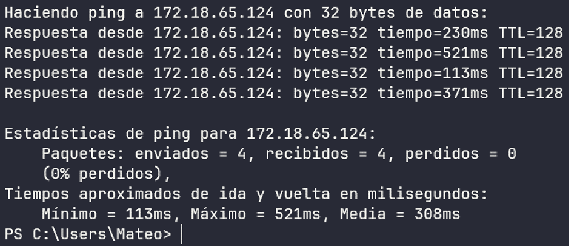

- CREACION DE USUARIO EN BASE DE DATOS
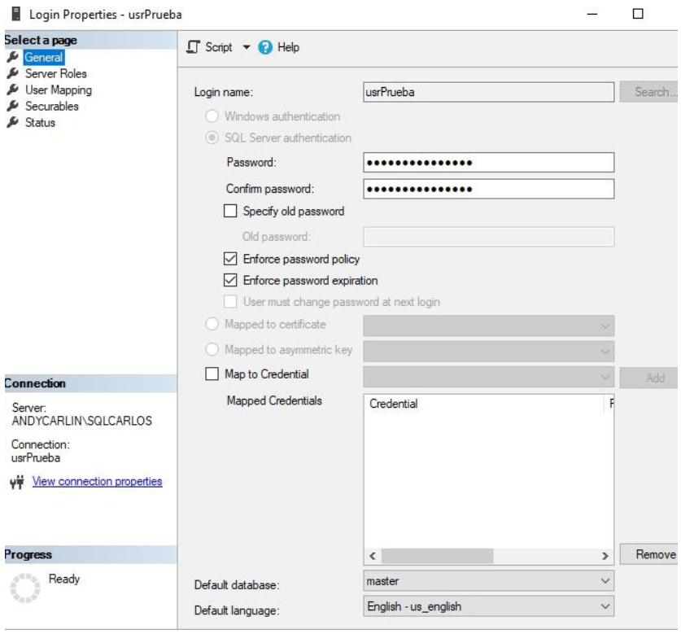

- CREACION DE ROLES
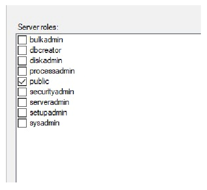

- REGLA DE ENTRADA EN PUERTO 1433
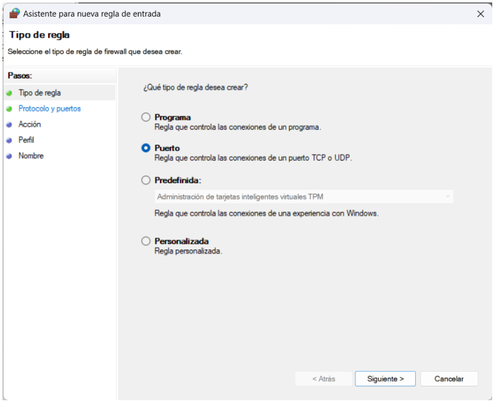
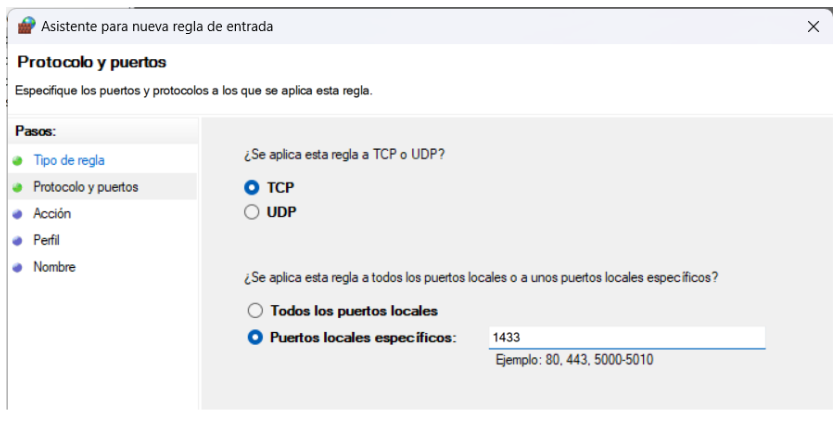
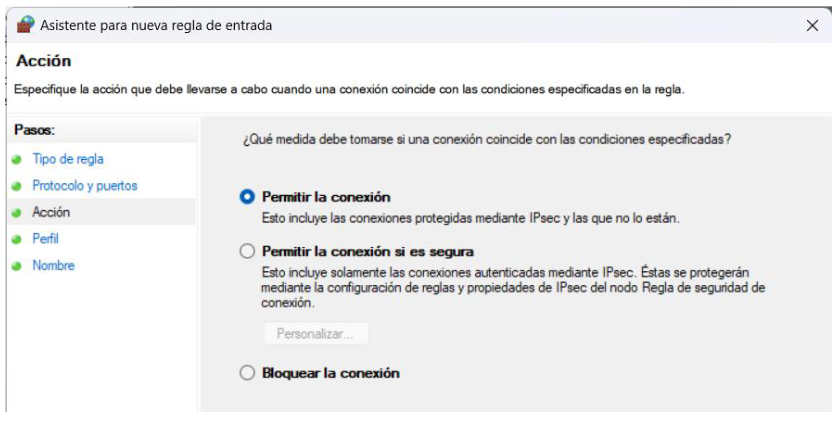
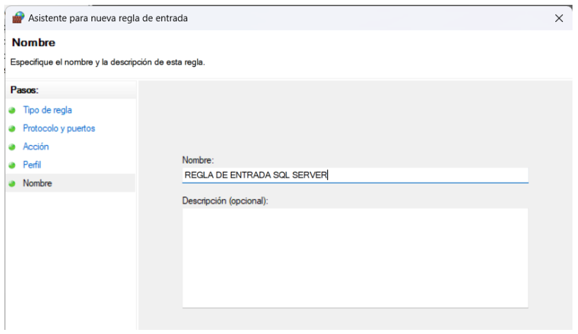

- REGLA DE SALIDA EN PUERTO 1433
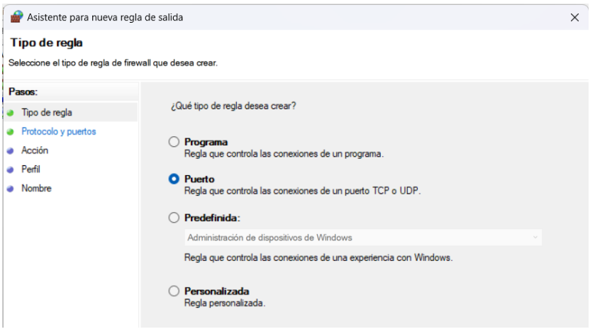
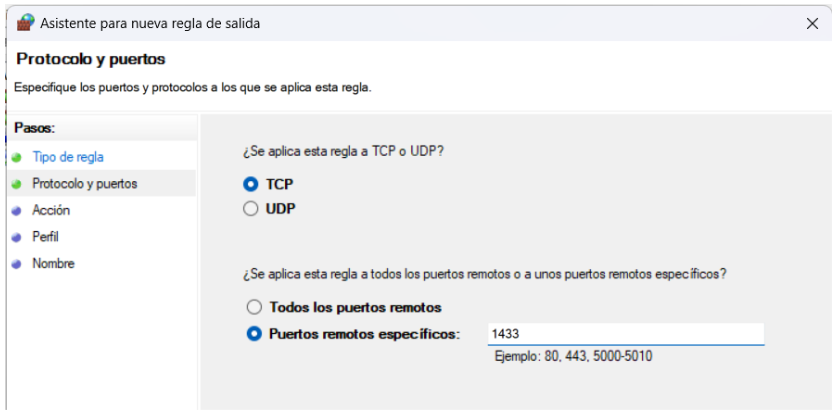
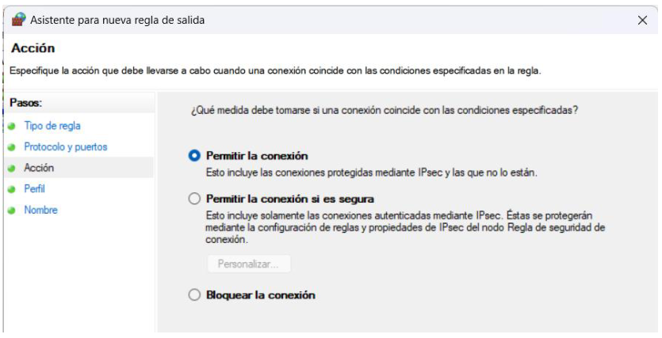
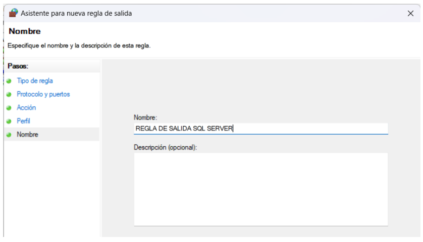

- CONEXIÓN A USUARIO CREADO
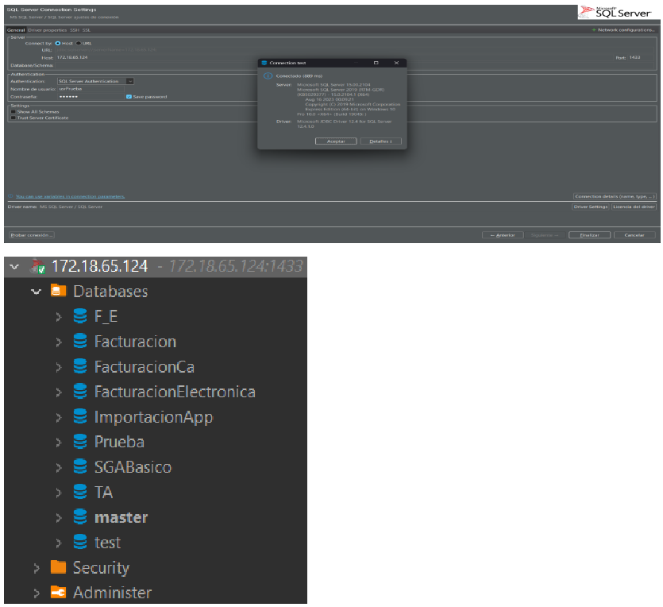