# Installation of microsft data analitic
Configuracion e instalacion de microsfot data analitics ***gestion base de datos***

1.	Instalacion del VSIX installer instalador de microsoft analitics

2.	 Visualización sincronizacion con visual studio

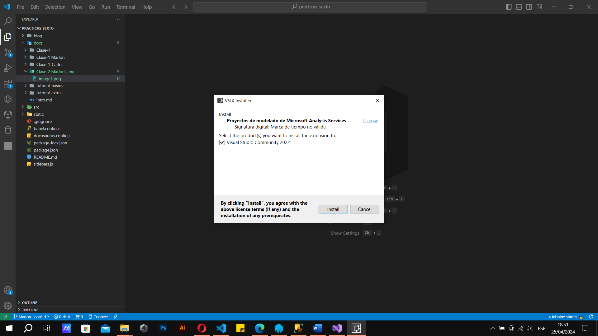

3.	 Treas  de instalacion

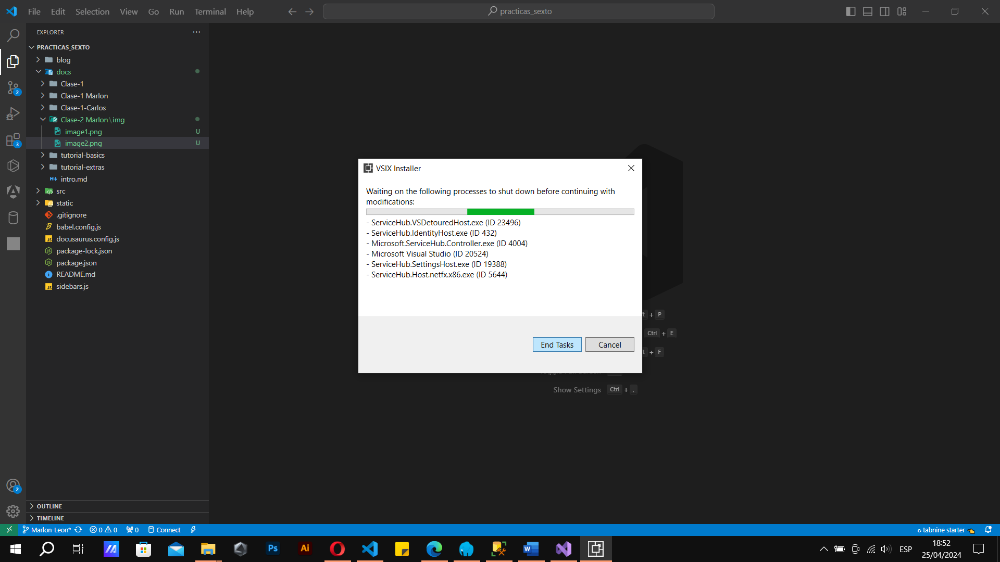

4.	 Instalacion completada

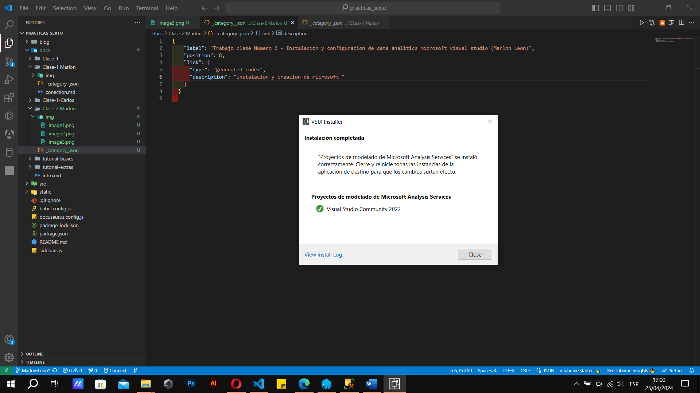

5.	 Conectar analitics a la cuenta de la base de datos

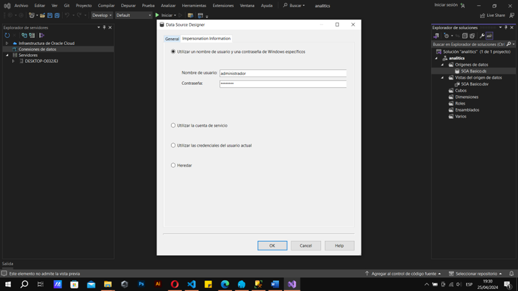

6.	 Conectar a la base de datos con el usuario administrador

7.	 Seleccionar el grupo de medidas las tablas

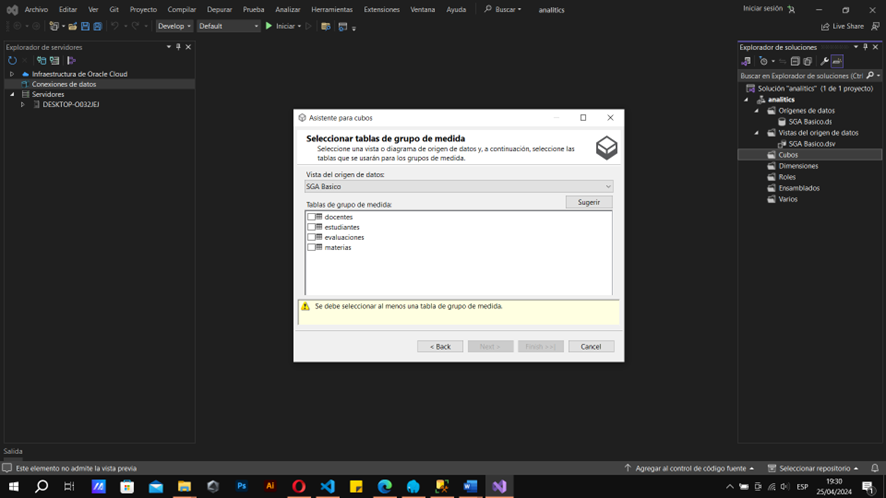

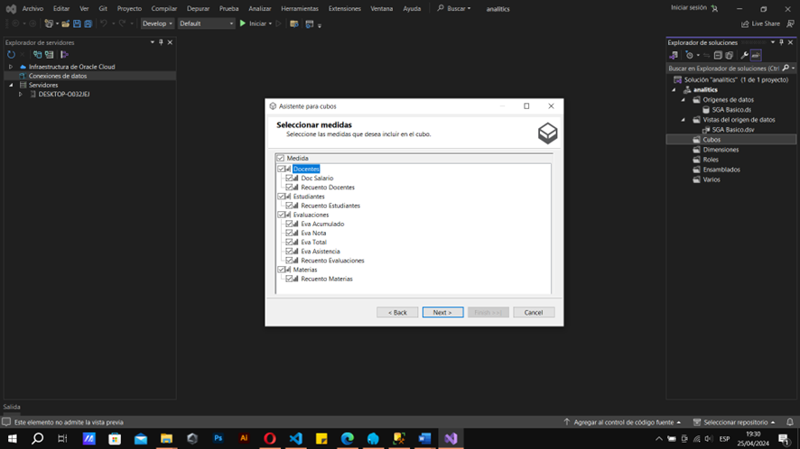

8.	 Seleccionar el grupo de dimensiones

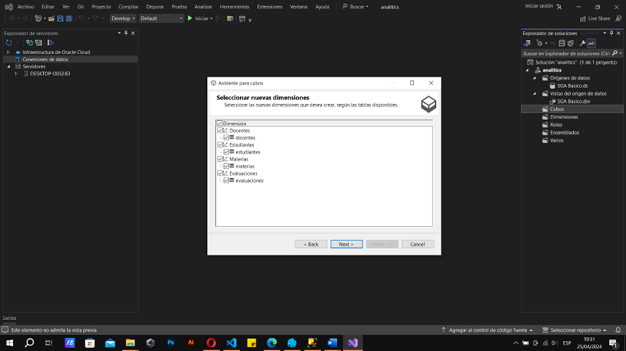

9.   Finalizacion de la creacion de las tablas dimensionales en el asistente

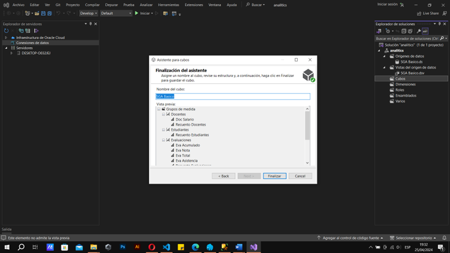

10.   Creacion del cubo de datos y guardado del mismo

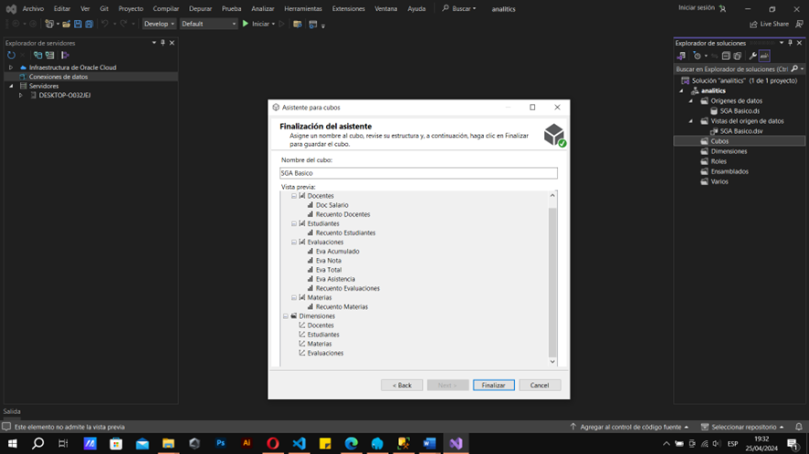

11.   Visualizacion del esquema del cubo de datos en analitics microsoft visual

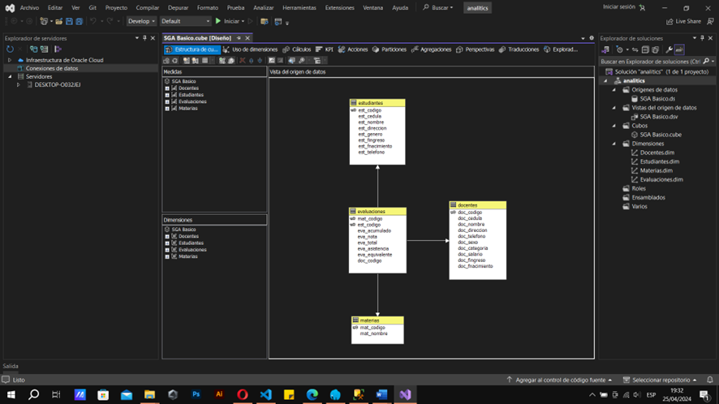

12.   Estructura del cubo con bases dimensionales tablas relacionadas

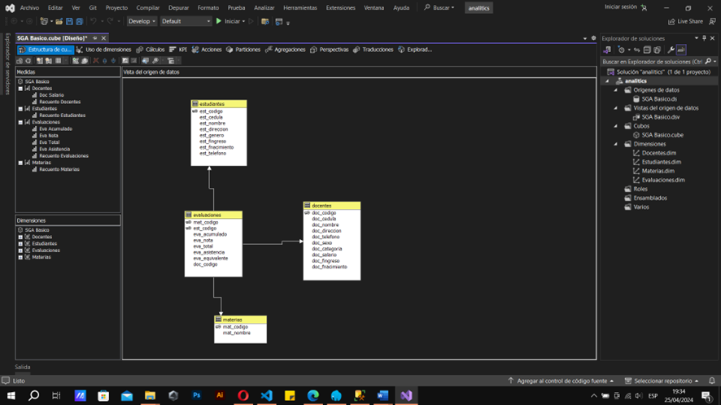