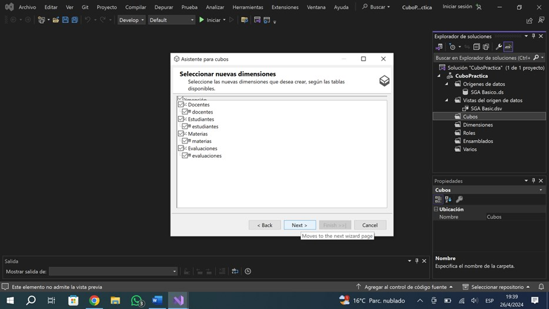

# Práctica 2
***Practica 2*** de Aministración de Sistemas de Gestión de Bases de Datos 

1. Abrir Visual Studio Installer.

2. Descargar ‘Microsfot Analysis Services Projects 2022’ e instalarlo.

3. Abrir Visual Studio 2022.

4. Escoger ‘Crear un proyecto’.

5. Escoger ‘Proyecto multidimensional de Analtics Services’.

6. Nombra tu proyecto y da click en ‘Crear’.

7. Click derecho en ‘Origen de datos’ y escoger ‘Nuevo origen de datos’.

8. Escoger ‘Create a data source based on an existin or new conecction’.

9. Colocar nombre de usuario y contraseña.

10. Finalizar proceso.

11. Click derecho en ‘Vistas del origen de datos’ y escoger ‘Nueva vista del origen de datos’.

12. Seleccionar un origen de datos.

13. Selecionar las tablas deseadas desde el ‘Origen disponible’ a ‘Objetos incluidos’.

14. Nombrar.

15. Click derecho en ‘Cubos’ y escoger ‘Nuevo cubo’.

16. Escoger ‘tablas existentes’.

17. Seleccionar tablas para el cubo.

18. Continuar con el proceso escogiendo ‘Next’.

19. Cubo creado.

