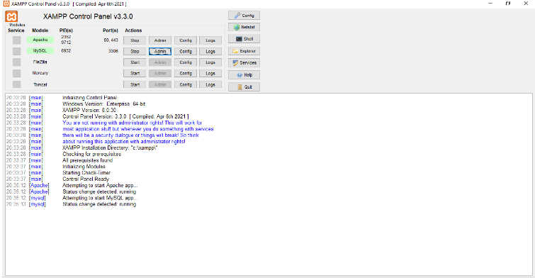
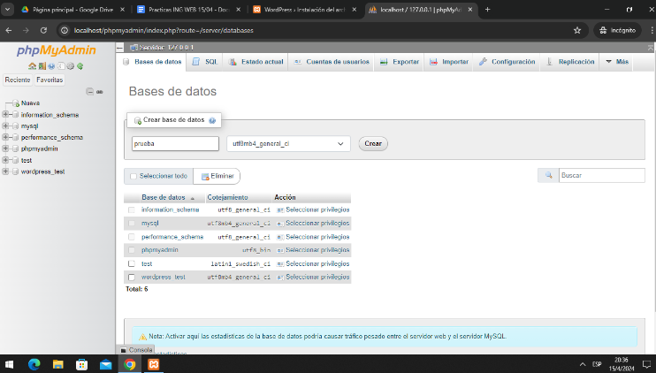
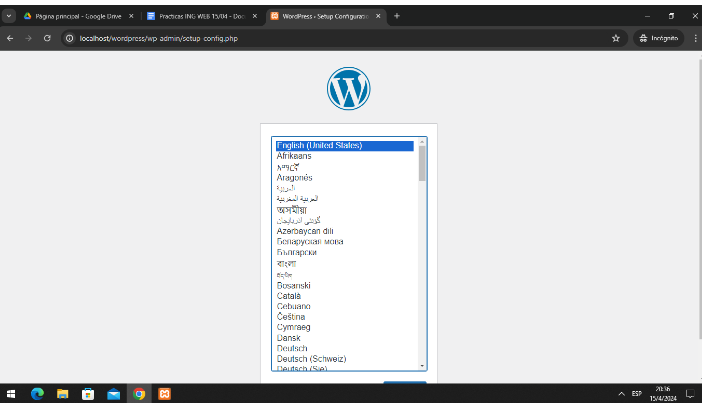
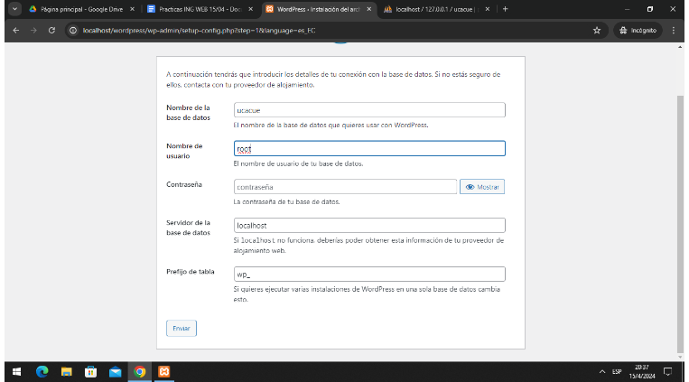
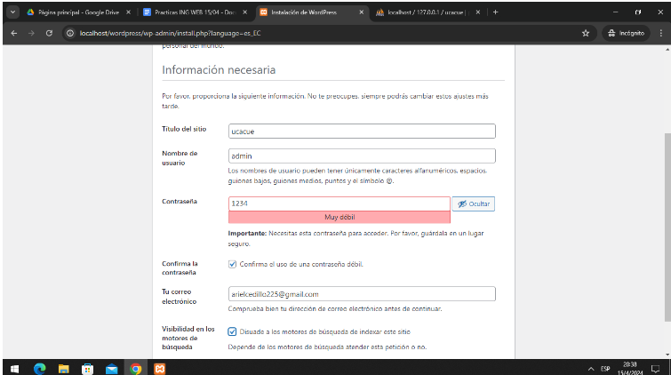
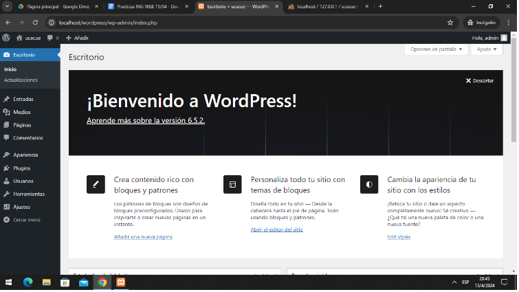
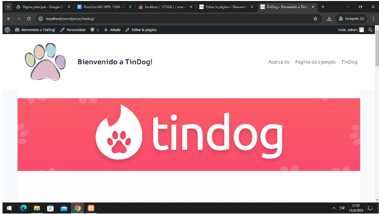
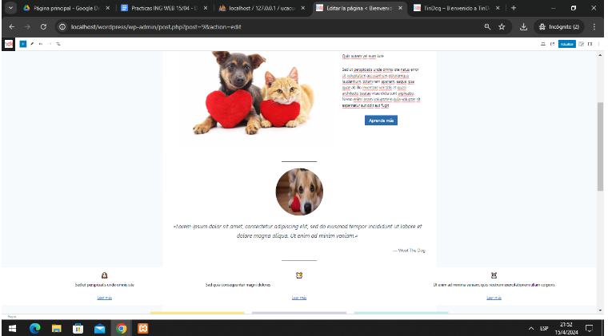
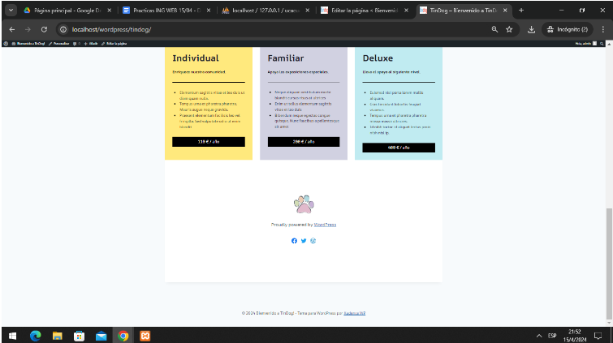

# Creación de página web y servidor

1. Levantar el servidor apache y MySql con XAMPP

2.  Crear una nueva base de datos

3.  Seleccionar idioma de Wordpress y configurarlo

4.  Colocar nombre y base de datos a usar

5.  Crear nuevo usuario

6.  Crear página web con las herramientas de Wordpress

7.  Crear header y banner

8.  Crear componentes en la página

9.  Añadir footer

