# Microsoft Analysis Services Project
**Cubo de Datos**

1. Abrir el Visual Studio Community un proyecto sin código, en la pestaña de extensiones, buscamos el Microsoft Analysis Services Project y lo instalamos.

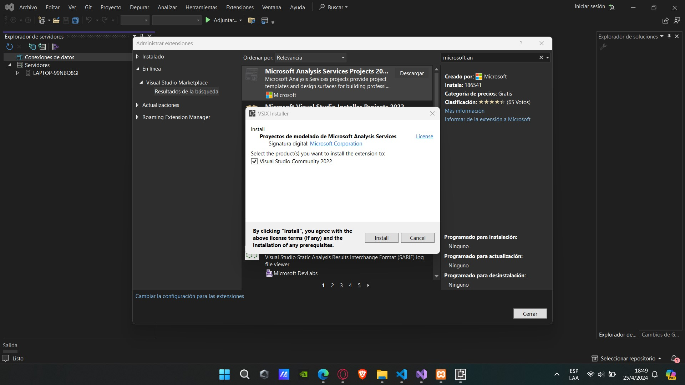

2. Una vez instalado, volvemos abrir el visual studio community y se crea un proyecto nuevo con la extensión que instalo, en este caso se muestra como “Proyecto multidimensional de Analysis Services”.

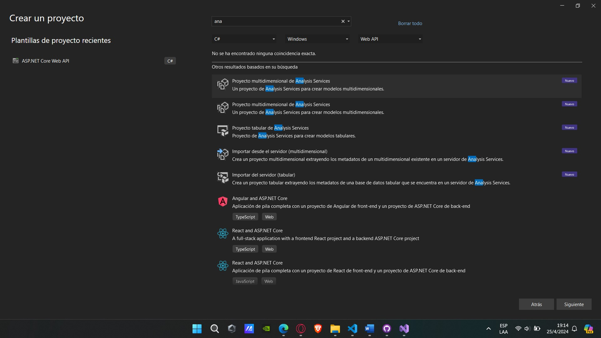

3. Configuramos el nuevo proyecto como el nombre del proyecto y se crea.

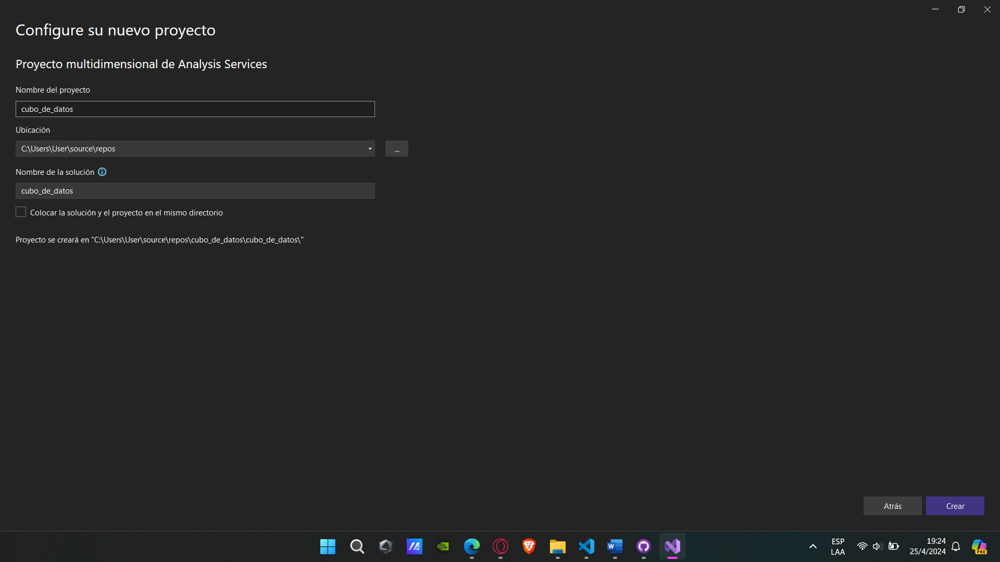

4. Una vez creado el proyecto, se procede a realizar la conexión a la base de datos.

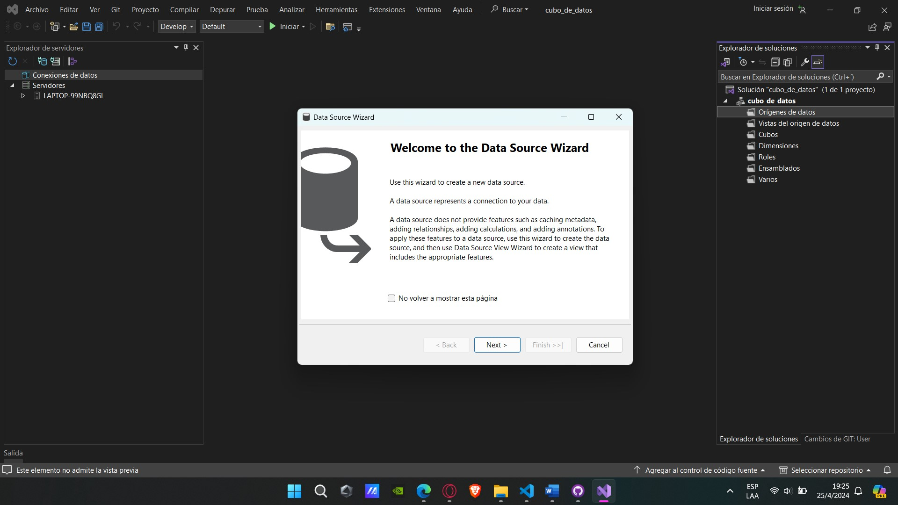

5. Se ingresa el nombre del servidor y la autenticación que puede ser “Windows Authentication” o “SQL Server Authentication”.

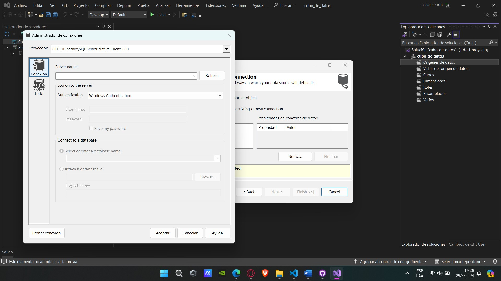

6. Elegido la autenticación se ingresa el “usuario” y “contraseña”, aparte de eso se selecciona la base de datos con la que va trabajar.

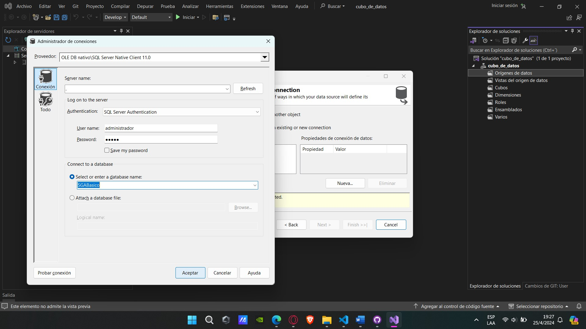

7. Se ingresa las credenciales para que se realice la conexión a la base de datos.

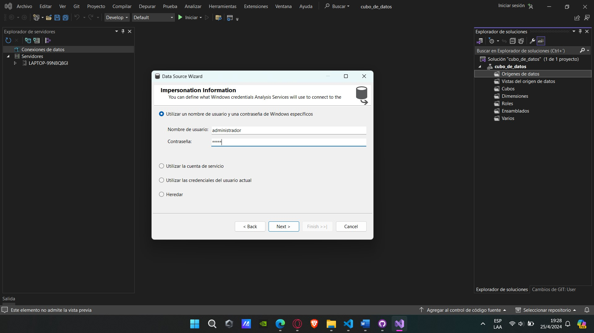

8. Selecciona la base datos para la creación de las vistas.

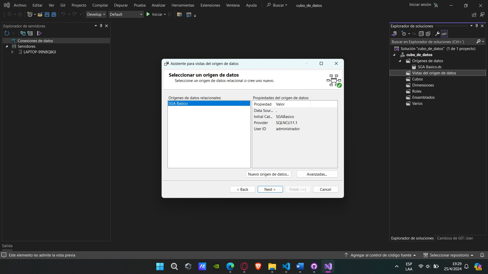

9. Selecciona los objetos de la base de datos que va incluir en la vista de origen de datos.

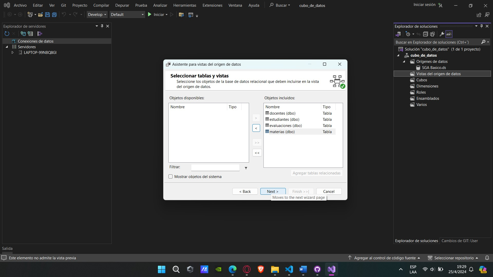

10. Se crea el cubo de datos con las tablas existentes.

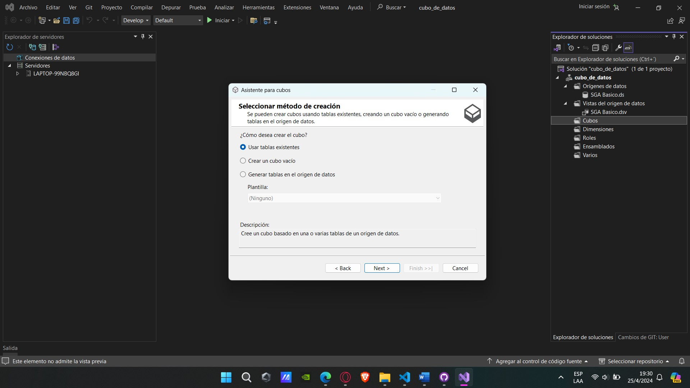

11. Selecciona las tablas que quiera utilizar para el grupo de medidas.

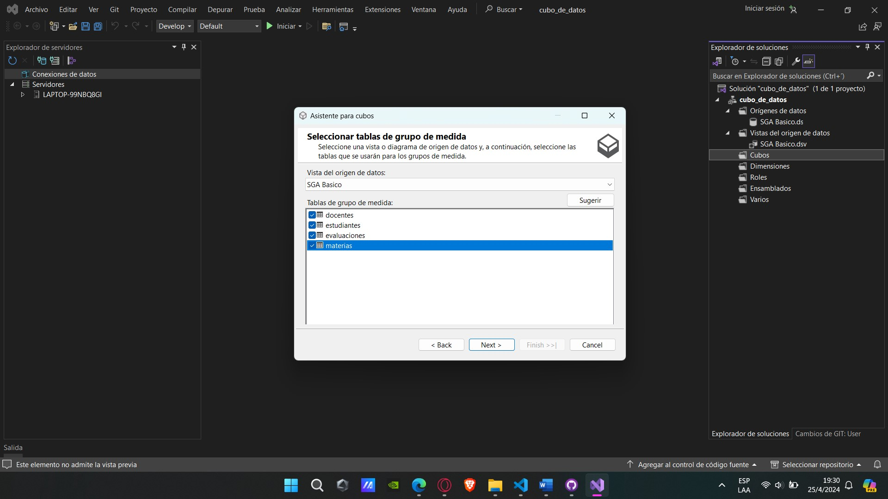

12. Selecciona las medidas que desea incluir en el cubo.

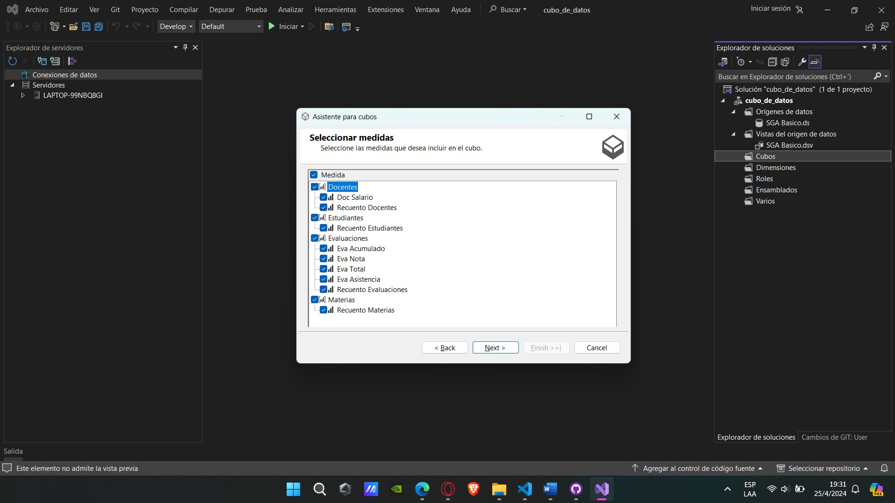

13. Selecciona las nuevas medidas que desea crear, según las tablas disponibles.

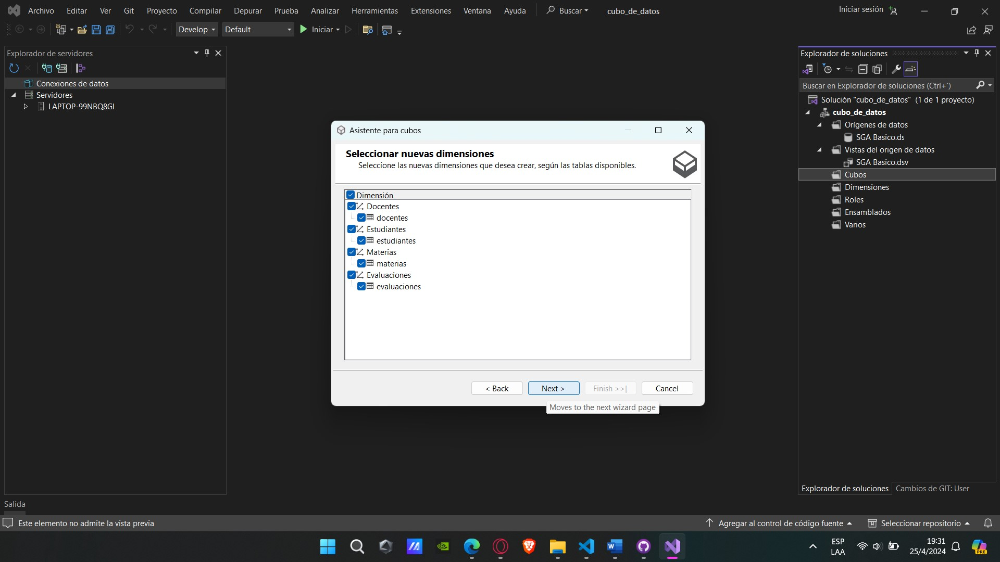

14. Asignar un nombre al cubo de datos, además se muestra una vista previa de la estructura.

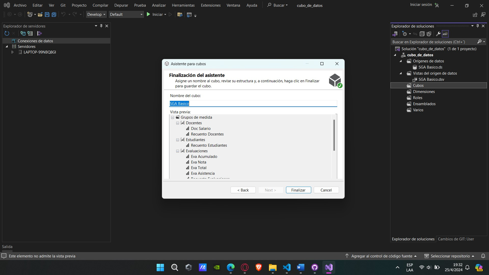

15. Se obtiene la creación de cubos de datos con toda su estructura, además de las medidas y las dimensiones.

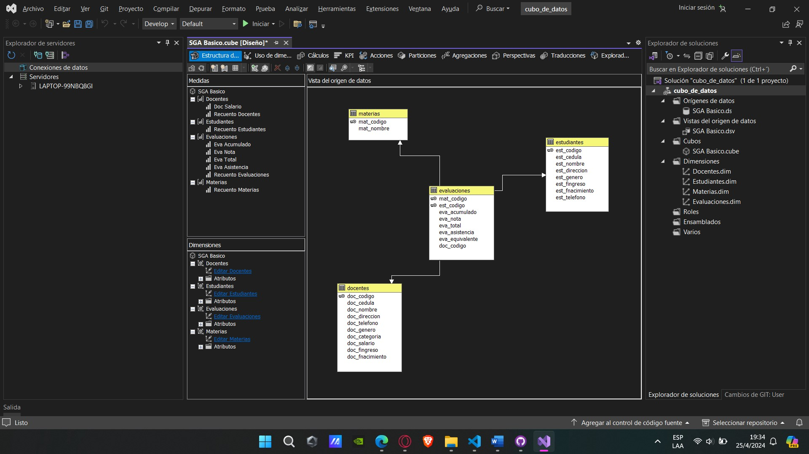