# Cubos.

1. Nuevo proyecto… y le da la opcion de continuar sin codigo

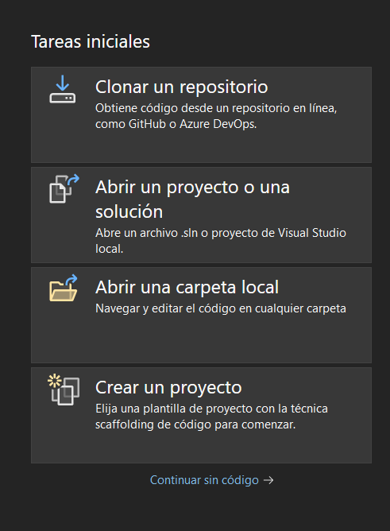

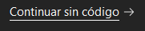

2. Instalacion de esta dependencia en el VS.

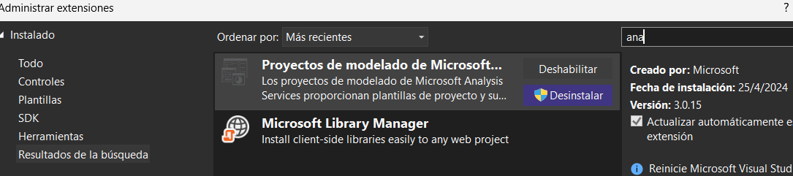
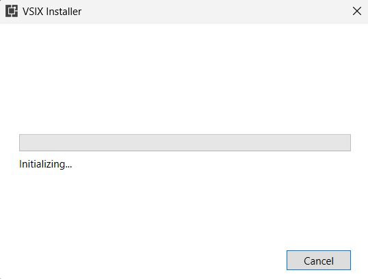

3. Configuracion de la base SGA Basico
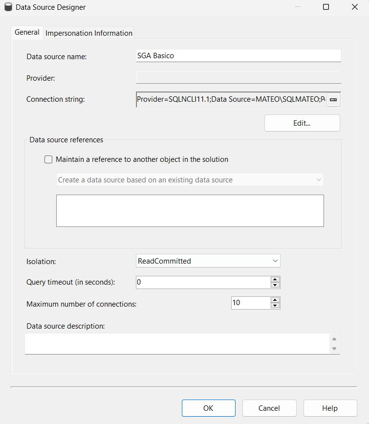

4. Esta es la estructura de cubo de datos que tenemos en el visual studio
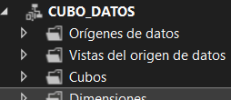

5. Origenes de datos, Vistas, Cubos y Dimensiones.
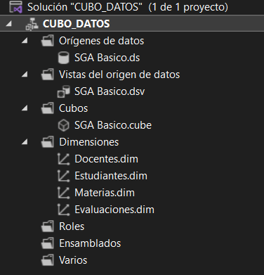

6. Es el cubo de datos de la base.
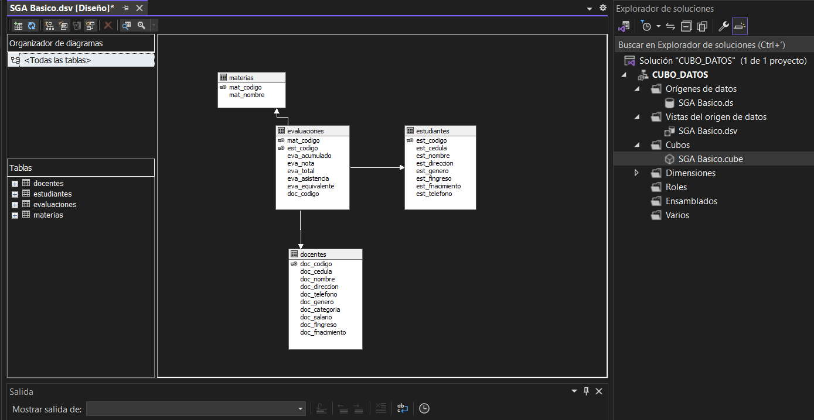

7. Las configuracion en el visual deben quedar de la siguiente manera:

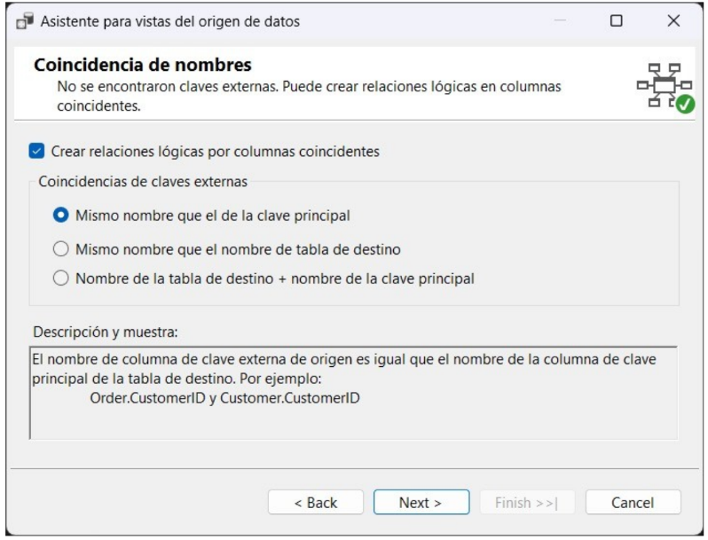

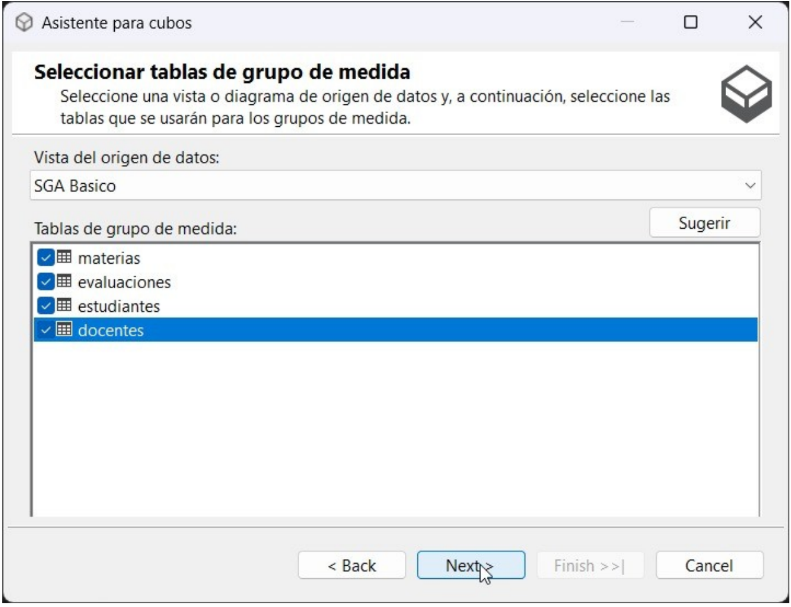

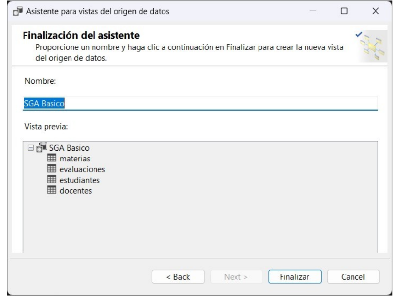

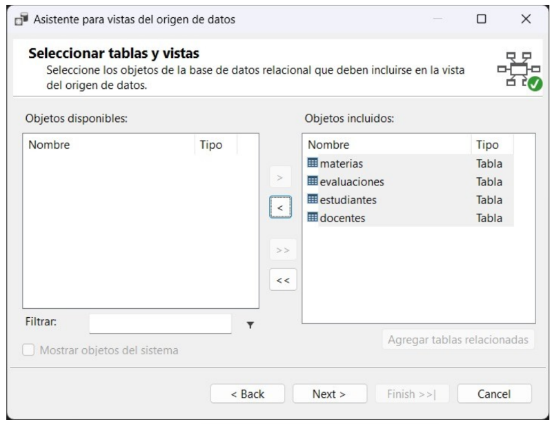

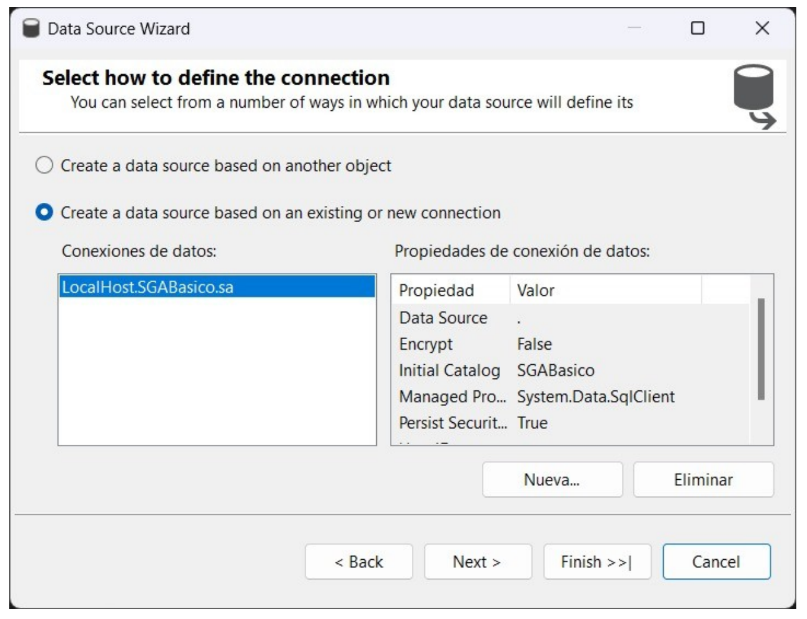