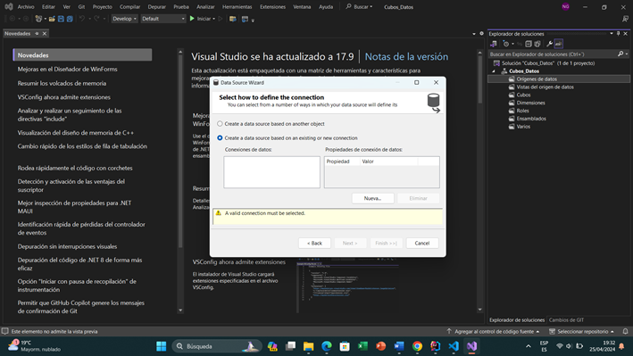
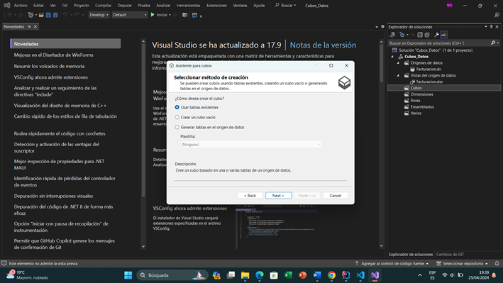
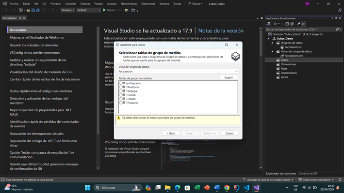
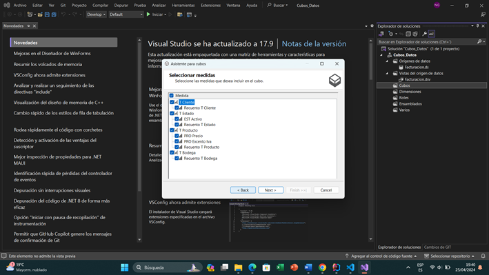
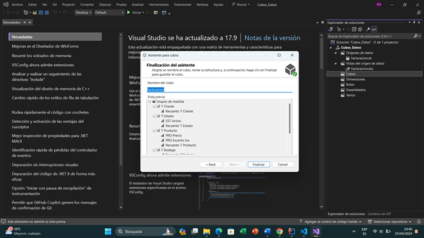
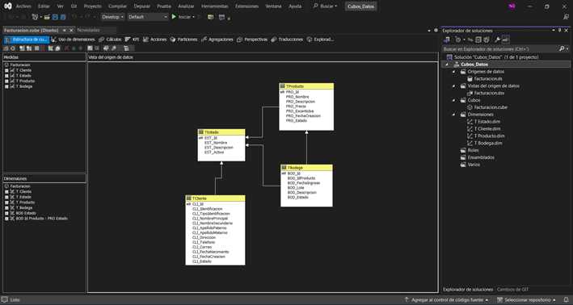

# Práctica 2
***Practica 2*** de Aministración de Sistemas de Gestión de Bases de Datos 

1. Crear un nuevo proyecto de cubos de datos.
2. Hacer la conexión con la base de datos de la cual se va a hacer el cubo de datos.

   

3. Seleccionar el método de creación.

   

4. Seleccionar las tablas de la base de datos las cuales se creará el cubo de datos.

   

5. Seleccionar las medidas de las cuales se va a crear el cubo.

   

6. Asignar el nombre al cubo y revisar la estructura.

   

7. El cubo se crea correctamente y se visualiza de la siguiente manera:

   