# PRACTICA #2 – CUBOS DE DATOS EN VISUAL STUDIO

## Estudiante: Pablo Astudillo

- ORÍGENES DE DATOS DE BBDD SGABASICO
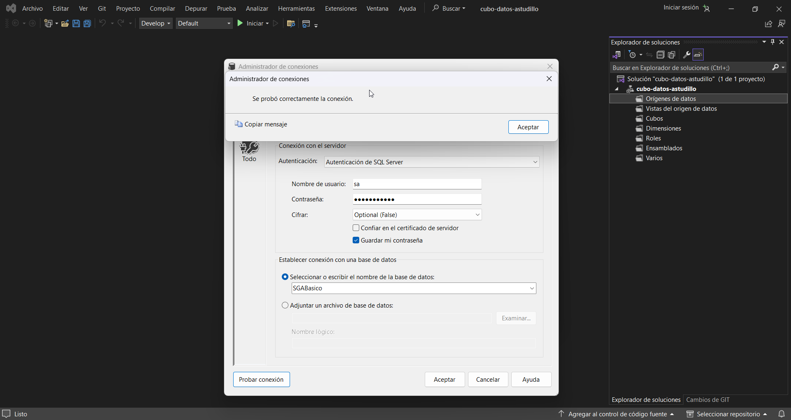
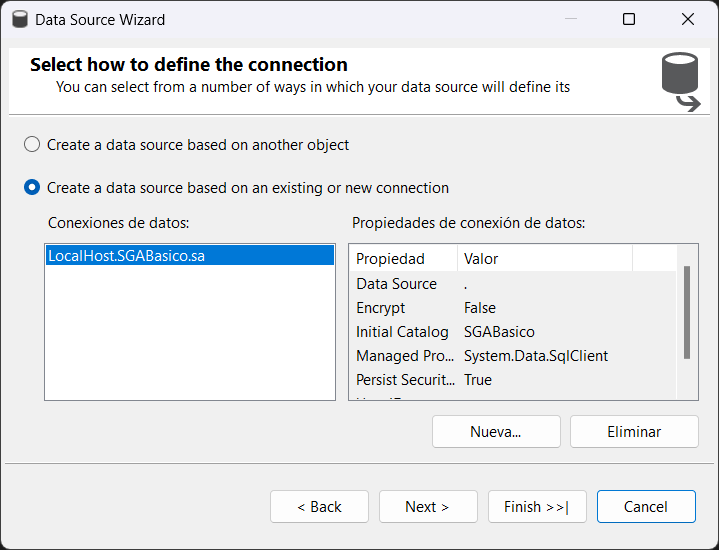
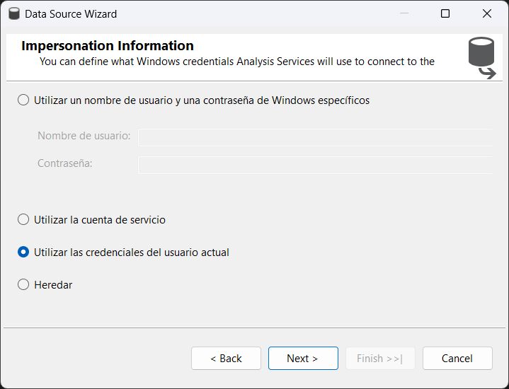
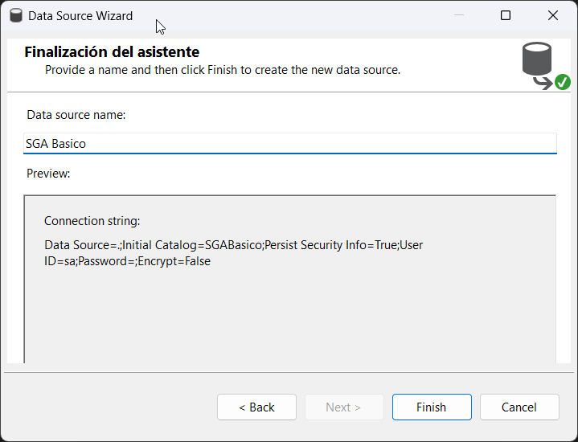

- VISTAS DEL ORIGEN DE DATOS DE SGABASICO
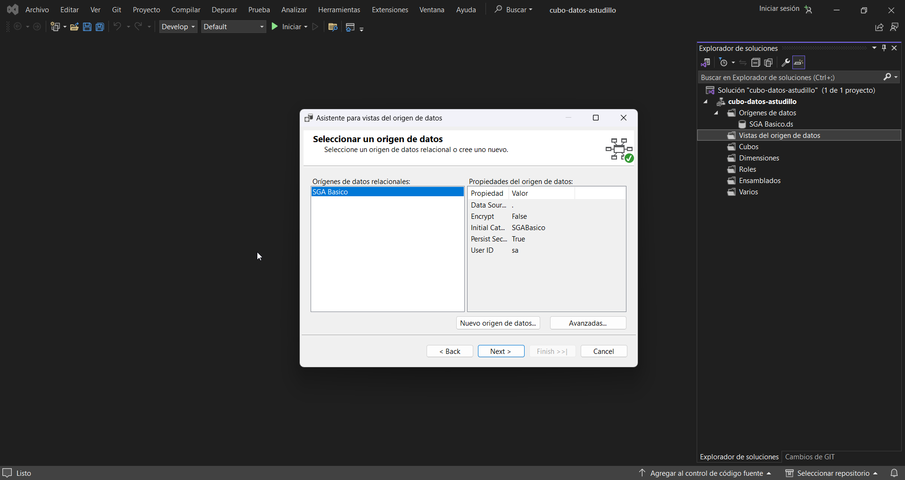
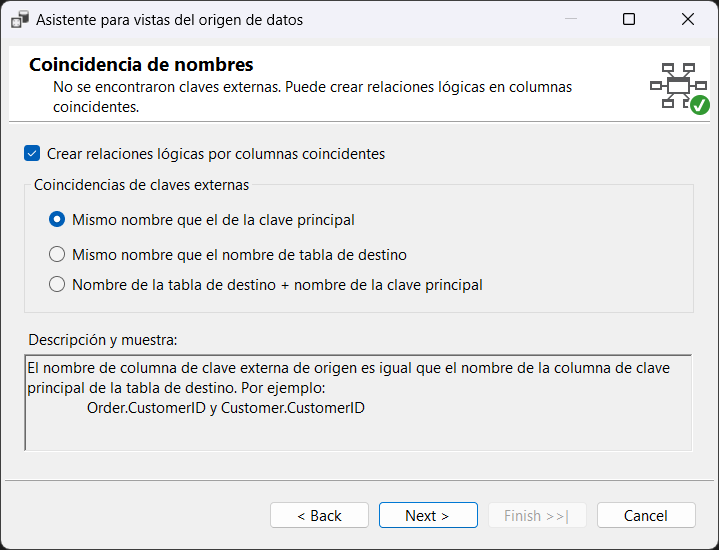
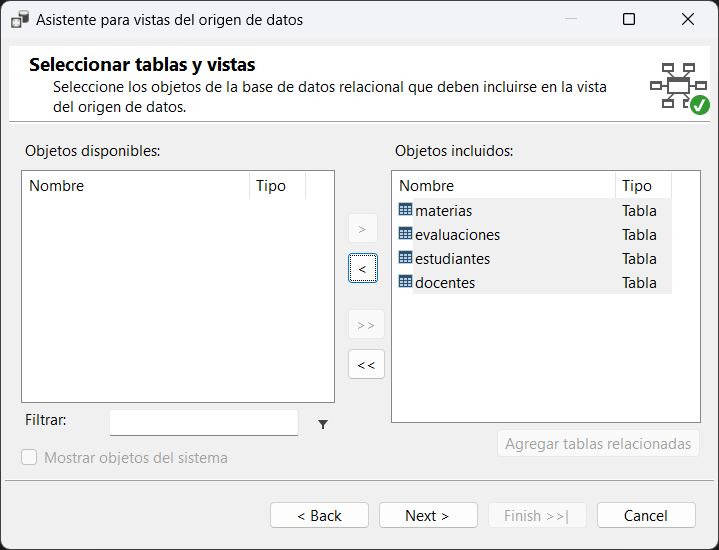
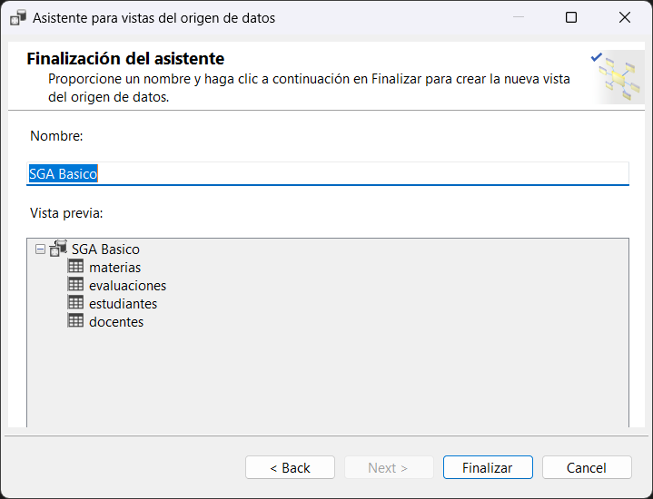

- CUBOS DE DATOS DE SGABASICO
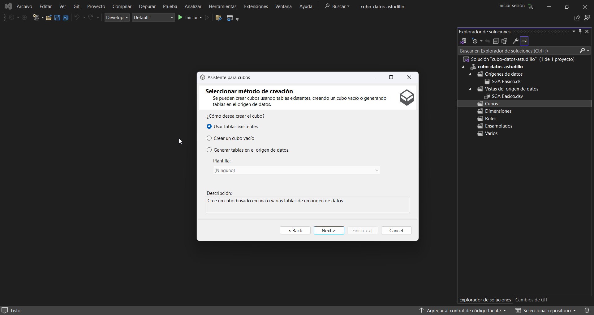
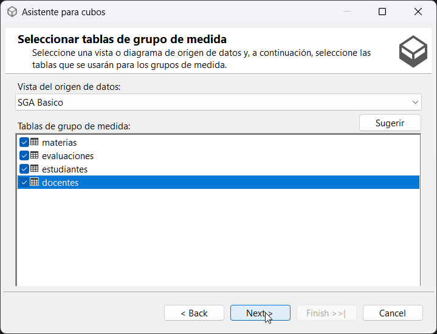

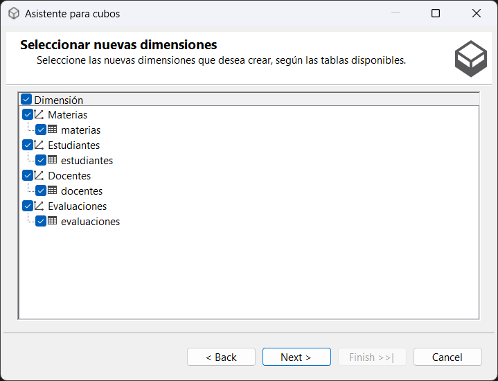
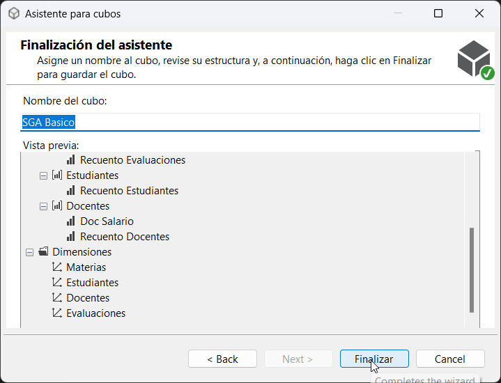

- COMPROBACIÓN
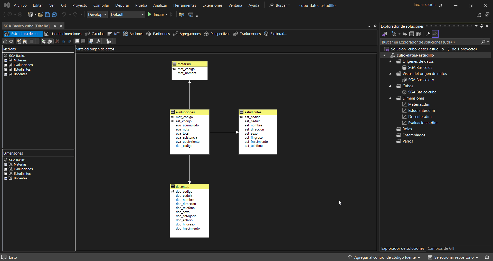