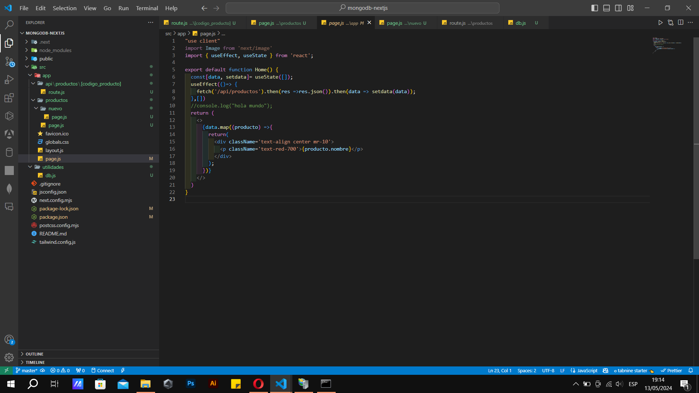

# Installation of microsft data analitic
Configuracion e instalacion de microsfot data analitics ***gestion base de datos***

1.	Creacion de las rutas de la API donde se generan los endpoints GET, POST, PUT y DELETE

2.	 Creacion de la pagina PAGE en Productos donde se creara la tabla que muestra los datos de la base en este caso de Productos

3.	 Creacion de la clase layout 

4.	 Creacion de la pagina page donde se configura el enlace que contiene el array de los parametros del endpoint en un fetch

5.	 Conexion a la base de  mongodb 

6.	 Creacion de la base de datos en mongo DB dentro de admin creamos una coleccion llamada productos
y creamos uno datos para probar la API

7.	 Podemos insertar datos por medio de registros en las colecciones y como es una base de datos no relacional no requiere claves foraneas ni IDs

