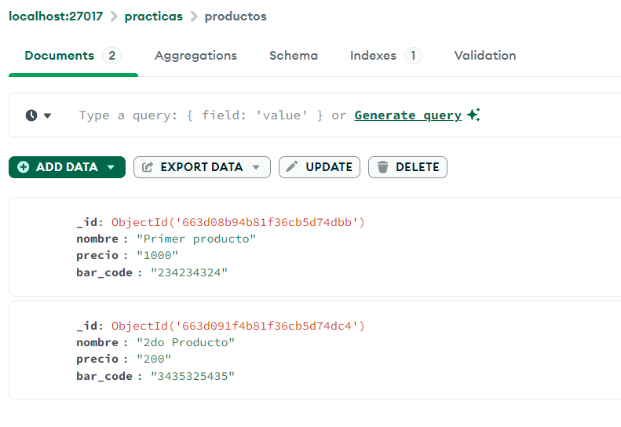
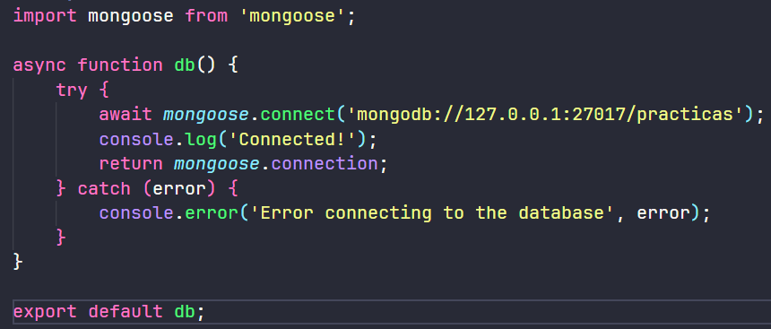
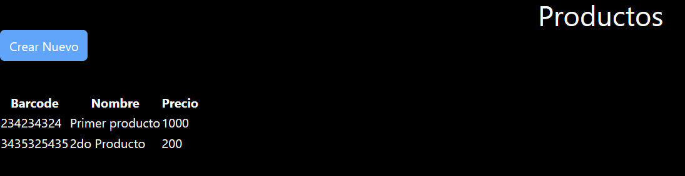
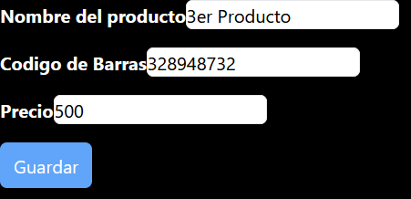
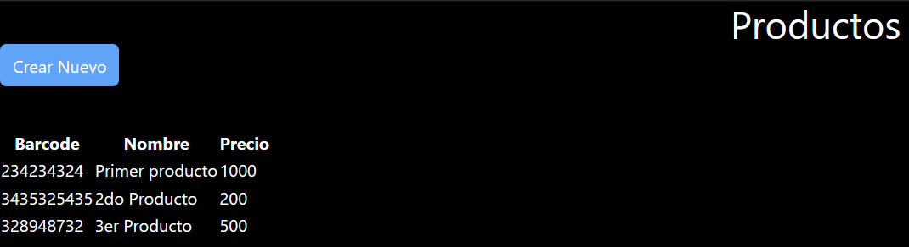
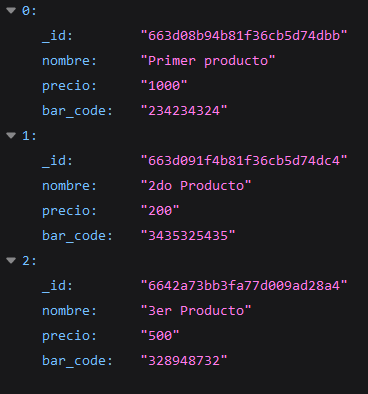
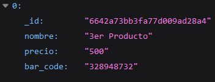
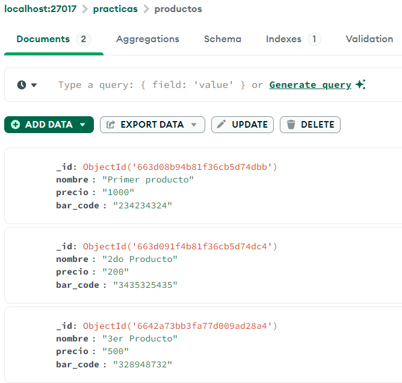

# PRACTICA #3 – NextJS con MongoDB

## Estudiante: Pablo Astudillo

- MongoDB Compass, base de datos no relacional en MongoDB, colección de productos.

- Conexión a la base de datos en app de NextJS con dependencia Mongoose.

- Componente react con tabla de los productos registrados.

- Formulario react para registrar un nuevo producto.

- Componente react con tabla actualizada de los productos registrados.

- Endpoint de app NextJS /api/productos.

- Endpoint de app NextJS /api/productos/328948732.

- MongoDB Compass, base de datos no relacional en MongoDB, colección de productos actualizados.

