# PRACTICA #4 – Backup de SQL Server con SQLBackupAndFTP

## Estudiante: Pablo Astudillo

- Descarga e instalación de SQLBackupAndFTP.
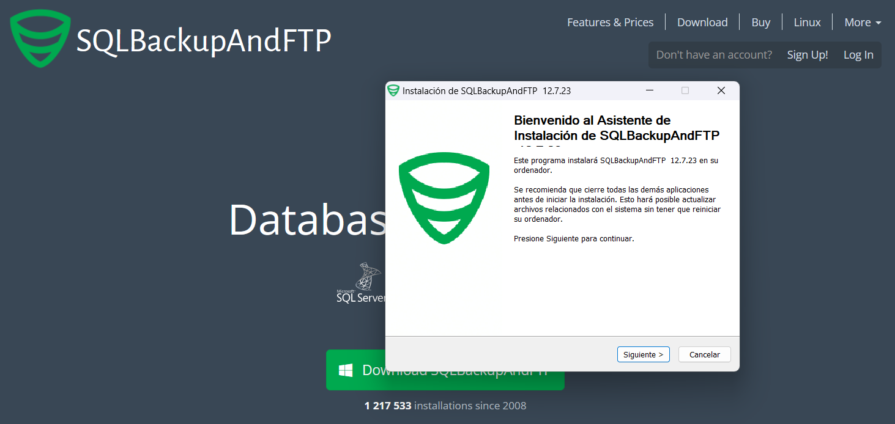

- Interfaz inicial de SQLBackupAndFTP.
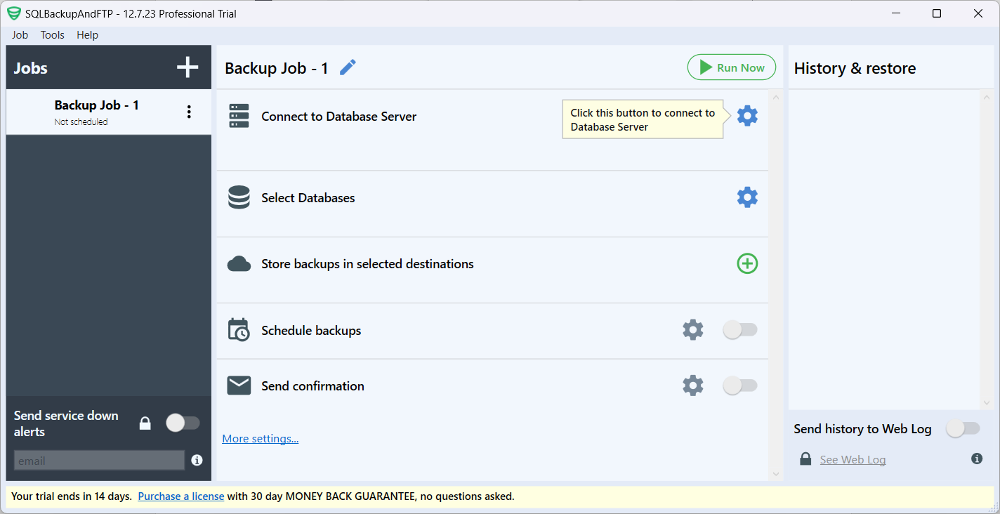

- Conexión a Base de Datos en Sql Server.
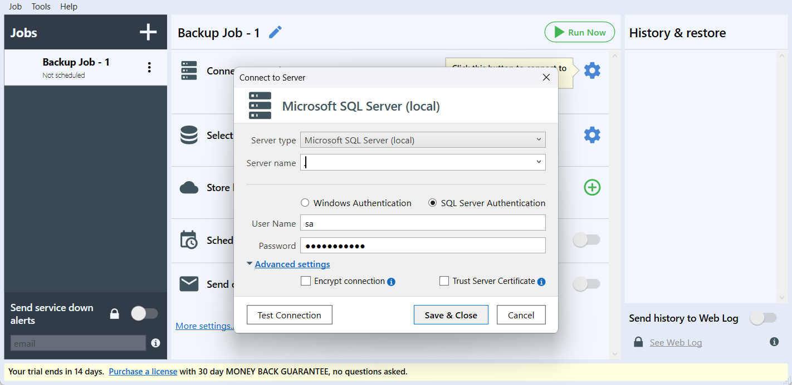

- Prueba de conexión exitosa.
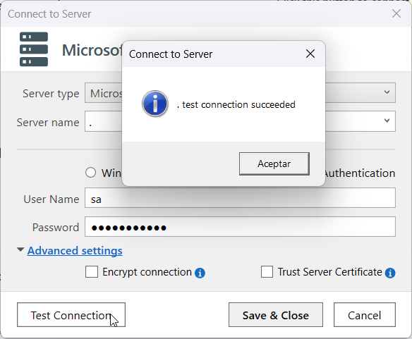

- Guarda la configuración de la conexión.
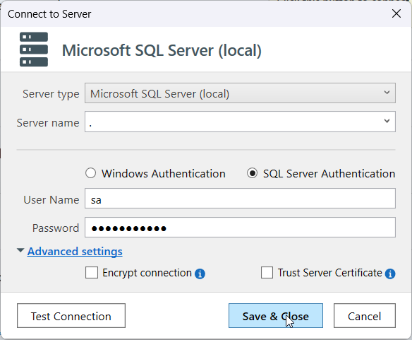

- Define el directorio donde se guardarán los respaldos de la base de datos.
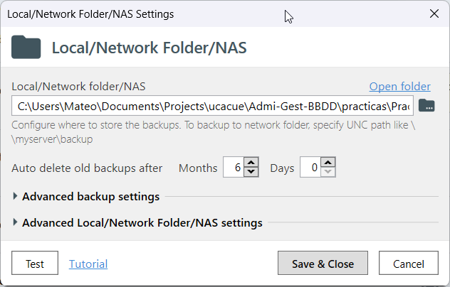

- Configura los horarios y días en los que se harán los respaldos.
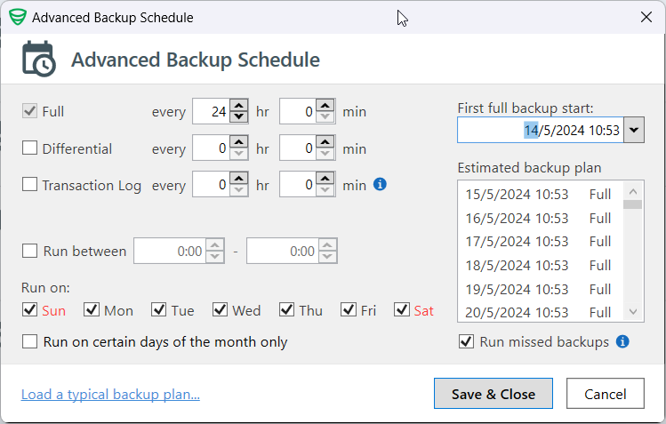

- Selecciona las bases de datos de las que se harán los respaldos.
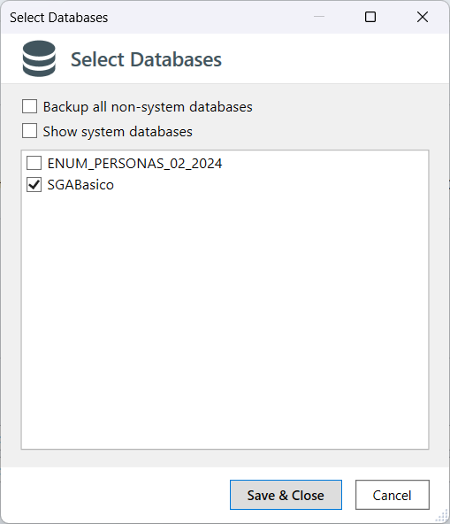

- Resumen de la configuración para realizar los respaldos.
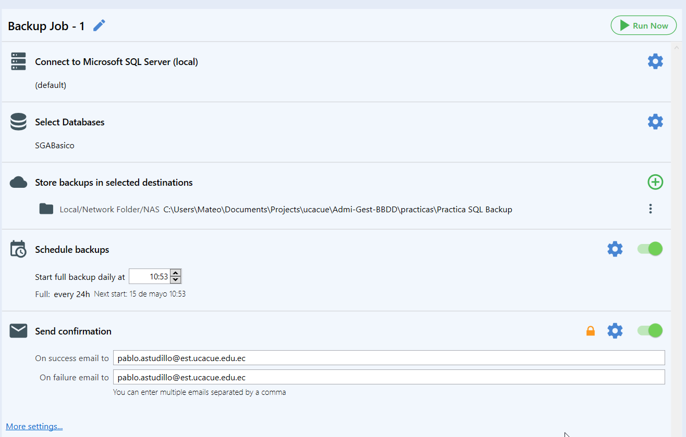

- Realiza el primer respaldo de la base de datos SGABasico.
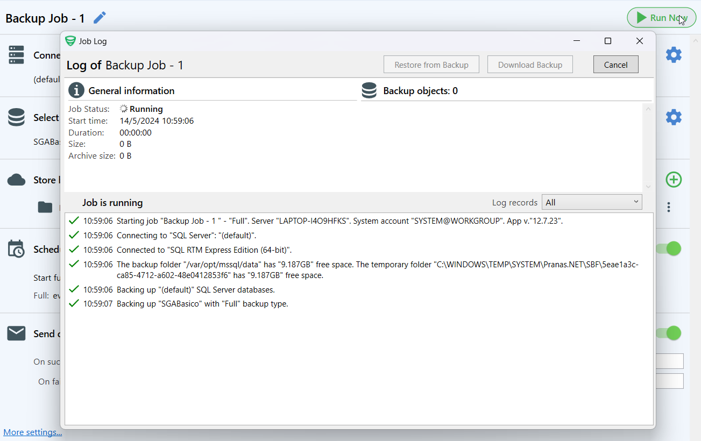

- Comprobación del .zip generado con el respaldo
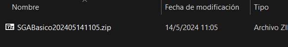

